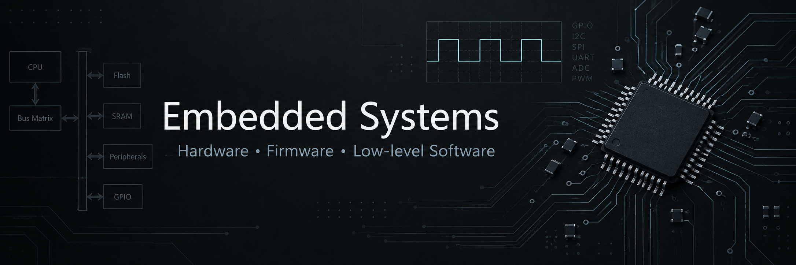

  

<strong>Building low-level systems from hardware architecture to firmware.</strong>

---

## About

Focused on hardware architecture, MCU firmware, C/C++ systems programming, and hardware-software integration.

## Technology

### Hardware

Digital Logic · CPU Architecture · Board-level Interfaces

### Firmware

8051/STC MCU · Peripheral Drivers · Interrupt-driven Systems

### Software

C/C++ · Modular Design · Embedded Software

## Featured Projects

<table>
  <tr>
    <td width="50%" valign="top">
      HARDWARE 
      <strong><a href="https://github.com/REliasCheng/Embedded-Systems-Foundations">Embedded Systems Foundations</a></strong>  
      Digital logic, simplified CPU architecture, circuit simulation, and hardware control.
    </td>
    <td width="50%" valign="top">
      SOFTWARE 
      <strong><a href="https://github.com/REliasCheng/Embedded-C-Cpp-Learning">Embedded C/C++</a></strong>  
      Memory, modular interfaces, callbacks, state machines, and host-tested software components.
    </td>
  </tr>
  <tr>
    <td width="50%" valign="top">
      FIRMWARE 
      <strong>MCU Firmware Projects</strong>  
      <a href="https://github.com/REliasCheng/stc89c52-learning">STC89C52</a> · <a href="https://github.com/REliasCheng/STC8-MCU-Learning">STC8</a> 
      Peripheral drivers, communication interfaces, and embedded applications.
    </td>
    <td width="50%" valign="top">
      SYSTEMS 
      <strong><a href="https://github.com/REliasCheng/BlueBridgeCup-MCU">BlueBridgeCup MCU</a></strong>  
      CT107D resource allocation, sensor interfaces, periodic tasks, and integrated control firmware.
    </td>
  </tr>
</table>

## Currently Exploring

`STM32` · `RTOS` · `Embedded Linux`
