  

<h1 align="center">Embedded Systems Developer</h1>

<strong>Building embedded systems from silicon to software.</strong>

---

## About

Embedded systems · Hardware-aware firmware · Low-level software · MCU architecture

## Technical Stack

### Hardware

`Digital Logic` · `MCU Architecture` · `PCB Interfaces`

### Firmware

`C` · `Peripheral Drivers` · `Interrupts` · `UART / I²C / SPI`

### Software

`C++` · `Modular Design` · `State Machines` · `Task Management`

## Featured Projects

### [Embedded Systems Foundations](https://github.com/REliasCheng/Embedded-Systems-Foundations)

Digital logic, circuit models, and a simplified CPU built from first principles. 
`Digital Logic` · `CPU Architecture` · `CircuitJS`

### [Embedded C/C++](https://github.com/REliasCheng/Embedded-C-Cpp-Learning)

Low-level programming, modular interfaces, state machines, and task management. 
`C/C++` · `Memory` · `Callbacks` · `Task Manager`

### [STC89C52 Learning](https://github.com/REliasCheng/stc89c52-learning)

Peripheral drivers and multi-module applications around the 8051 architecture. 
`GPIO` · `Timer` · `UART` · `I²C` · `OLED`

### [BlueBridgeCup MCU](https://github.com/REliasCheng/BlueBridgeCup-MCU)

CT107D firmware focused on latch control, peripheral coordination, and resource allocation. 
`CT107D` · `74HC573` · `Sensors` · `Periodic Tasks`

### [C51 Board Lab](https://github.com/REliasCheng/C51-Board-Lab)

Board-level resource analysis, shared buses, device selection, and peripheral connections. 
`STC89C52` · `74HC138` · `74HC245` · `Board Resources`

### [STC8 MCU Learning](https://github.com/REliasCheng/STC8-MCU-Learning)

Enhanced 8051 peripherals, communication interfaces, event-driven modules, and RTX51 Tiny. 
`STC8H8K64U` · `USB HID` · `Interrupts` · `RTX51 Tiny`

## Architecture

`Hardware` → `Firmware` → `Real-time Systems` → `Embedded Linux`

Current direction: STM32 · RTOS · Embedded Linux
