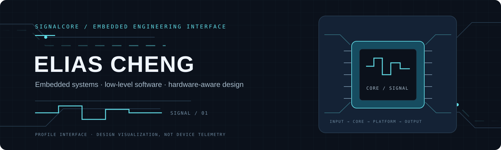
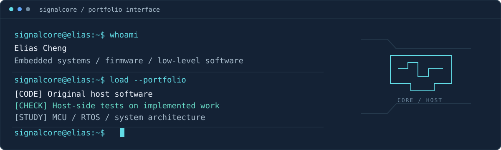
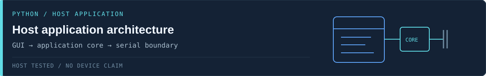
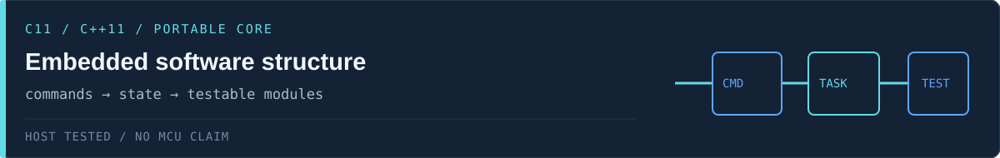
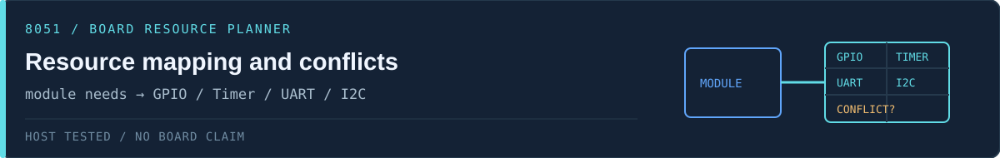
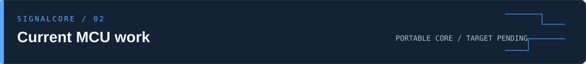
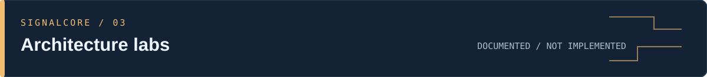
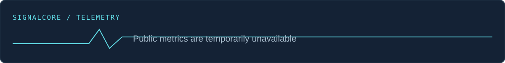
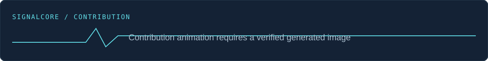
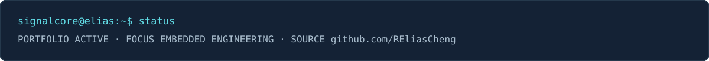

<picture>
  <source media="(prefers-reduced-motion: reduce) and (prefers-color-scheme: dark)" srcset="assets/brand/hero-static.svg">
  <source media="(prefers-reduced-motion: reduce) and (prefers-color-scheme: light)" srcset="assets/brand/hero-static-light.svg">
  <source media="(prefers-color-scheme: dark)" srcset="assets/brand/hero-dark.svg">
  <source media="(prefers-color-scheme: light)" srcset="assets/brand/hero-light.svg">
  
</picture>

# Elias Cheng

I build testable embedded software, MCU application cores, board-planning tools, and host applications. This profile separates **implemented work** from **architecture studies** and **exploration**; host tests are not MCU or hardware validation.

<picture>
  <source media="(prefers-reduced-motion: reduce) and (prefers-color-scheme: dark)" srcset="assets/brand/terminal-static-dark.svg">
  <source media="(prefers-reduced-motion: reduce) and (prefers-color-scheme: light)" srcset="assets/brand/terminal-static-light.svg">
  <source media="(prefers-color-scheme: dark)" srcset="assets/brand/terminal-dark.svg">
  <source media="(prefers-color-scheme: light)" srcset="assets/brand/terminal-light.svg">
  
</picture>

## Featured engineering projects

Original, inspectable implementations with public host-side evidence. The linked repositories define their own build and hardware limits.

<picture>
  <source media="(max-width: 600px) and (prefers-color-scheme: dark)" srcset="assets/cards/featured-python-mobile-dark.svg">
  <source media="(max-width: 600px) and (prefers-color-scheme: light)" srcset="assets/cards/featured-python-mobile-light.svg">
  <source media="(prefers-color-scheme: dark)" srcset="assets/cards/featured-python-dark.svg">
  <source media="(prefers-color-scheme: light)" srcset="assets/cards/featured-python-light.svg">
  
</picture>

[Python Host Application](https://github.com/REliasCheng/Python-Host-Application-Lab) — Python/PyQt5 serial application with a testable core and mock backend. Host tests, static checks and package build; no device validation.

Design decision: keep serial I/O behind an application boundary so behavior can be tested without a connected device. Evidence: [Source](https://github.com/REliasCheng/Python-Host-Application-Lab/blob/main/src/host_app/core/application.py) · [Tests](https://github.com/REliasCheng/Python-Host-Application-Lab/blob/main/tests/test_application.py) · [CI](https://github.com/REliasCheng/Python-Host-Application-Lab/actions/workflows/test.yml) · [Design](https://github.com/REliasCheng/Python-Host-Application-Lab/blob/main/docs/system-architecture.md).

<picture>
  <source media="(max-width: 600px) and (prefers-color-scheme: dark)" srcset="assets/cards/featured-embedded-cpp-mobile-dark.svg">
  <source media="(max-width: 600px) and (prefers-color-scheme: light)" srcset="assets/cards/featured-embedded-cpp-mobile-light.svg">
  <source media="(prefers-color-scheme: dark)" srcset="assets/cards/featured-embedded-cpp-dark.svg">
  <source media="(prefers-color-scheme: light)" srcset="assets/cards/featured-embedded-cpp-light.svg">
  
</picture>

[Embedded C/C++ Core](https://github.com/REliasCheng/Embedded-C-Cpp-Learning) — portable command, buffer and task-state modules. Host tests; no MCU target validation.

Design decision: reject incomplete command output without committing partial state. Evidence: [Source](https://github.com/REliasCheng/Embedded-C-Cpp-Learning/blob/main/projects/06_%E7%BB%BC%E5%90%88%E8%BD%AF%E4%BB%B6%E5%AE%9E%E8%B7%B5/%E5%B5%8C%E5%85%A5%E5%BC%8F%E5%91%BD%E4%BB%A4%E5%A4%84%E7%90%86%E6%A1%86%E6%9E%B6/practice/src/command.c) · [Tests](https://github.com/REliasCheng/Embedded-C-Cpp-Learning/blob/main/projects/06_%E7%BB%BC%E5%90%88%E8%BD%AF%E4%BB%B6%E5%AE%9E%E8%B7%B5/%E5%B5%8C%E5%85%A5%E5%BC%8F%E5%91%BD%E4%BB%A4%E5%A4%84%E7%90%86%E6%A1%86%E6%9E%B6/tests/test_command_framework.c) · [CI](https://github.com/REliasCheng/Embedded-C-Cpp-Learning/actions/workflows/host-tests.yml) · [Design](https://github.com/REliasCheng/Embedded-C-Cpp-Learning/blob/main/docs/%E5%B7%A5%E7%A8%8B%E7%BB%93%E6%9E%84%E8%AE%BE%E8%AE%A1.md).

<picture>
  <source media="(max-width: 600px) and (prefers-color-scheme: dark)" srcset="assets/cards/featured-c51-mobile-dark.svg">
  <source media="(max-width: 600px) and (prefers-color-scheme: light)" srcset="assets/cards/featured-c51-mobile-light.svg">
  <source media="(prefers-color-scheme: dark)" srcset="assets/cards/featured-c51-dark.svg">
  <source media="(prefers-color-scheme: light)" srcset="assets/cards/featured-c51-light.svg">
  
</picture>

[C51 Board Resource Planner](https://github.com/REliasCheng/C51-Board-Lab) — 8051 resource mapping and conflict detection. Host tests; no board validation.

Design decision: model module resource demands explicitly before reporting GPIO, Timer, UART or I2C conflicts. Evidence: [Source](https://github.com/REliasCheng/C51-Board-Lab/blob/main/projects/06_%E7%BB%BC%E5%90%88%E5%BA%94%E7%94%A8/board-resource-planner/practice/src/board_resources.c) · [Tests](https://github.com/REliasCheng/C51-Board-Lab/blob/main/projects/06_%E7%BB%BC%E5%90%88%E5%BA%94%E7%94%A8/board-resource-planner/tests/test_board_resources.c) · [CI](https://github.com/REliasCheng/C51-Board-Lab/actions/workflows/host-tests.yml) · [Design](https://github.com/REliasCheng/C51-Board-Lab/blob/main/projects/06_%E7%BB%BC%E5%90%88%E5%BA%94%E7%94%A8/board-resource-planner/README.md).

## Current MCU work

Application and communication cores are distinguishable from a complete target firmware release.

<picture>
  <source media="(prefers-color-scheme: dark)" srcset="assets/cards/mcu-dark.svg">
  <source media="(prefers-color-scheme: light)" srcset="assets/cards/mcu-light.svg">
  
</picture>

- [STC8 MCU Learning](https://github.com/REliasCheng/STC8-MCU-Learning) — C89 UART RX ring buffer and 8051 adapter boundary. Host-tested core; no Keil target or board evidence.
- [STC89C52 Learning](https://github.com/REliasCheng/stc89c52-learning) — RTC, temperature and configuration state behind platform callbacks. Host tests; C51 target and hardware not verified.
- [BlueBridgeCup MCU](https://github.com/REliasCheng/BlueBridgeCup-MCU) — CT107D resource, timing and control policies. Host-tested policies; no complete target or board evidence.

## Architecture labs

These repositories communicate system design and technical boundaries. They are **not** presented as publicly implemented or hardware-verified systems.

<picture>
  <source media="(prefers-color-scheme: dark)" srcset="assets/cards/architecture-dark.svg">
  <source media="(prefers-color-scheme: light)" srcset="assets/cards/architecture-light.svg">
  
</picture>

- [ARM Cortex-M](https://github.com/REliasCheng/ARM-Cortex-M-Development-Lab) — startup, interrupts, clocks and driver layering.
- [FreeRTOS](https://github.com/REliasCheng/FreeRTOS-Embedded-Lab) — scheduling, IPC and ISR-to-task design.
- [LVGL Embedded GUI](https://github.com/REliasCheng/LVGL-Embedded-GUI-Lab) — display, input, rendering and event pipeline.
- [Wireless / IoT](https://github.com/REliasCheng/Wireless-IoT-Embedded-Lab) — native Wi-Fi → lwIP → TCP → plain MQTT model; no TLS or live sensor evidence.
- [Firmware Update / OTA](https://github.com/REliasCheng/Embedded-OTA-Update-Lab) — bootloader, UART/YMODEM, MQTT and CRC boundary model; no A/B or rollback claim.

## Exploration and foundations

<picture>
  <source media="(prefers-color-scheme: dark)" srcset="assets/cards/exploration-dark.svg">
  <source media="(prefers-color-scheme: light)" srcset="assets/cards/exploration-light.svg">
  
</picture>

- [Embodied Robotics Arm](https://github.com/REliasCheng/Embodied-Robotics-Arm-Lab) — LeRobot/robotic-arm integration study involving third-party code; no functional or hardware run claimed.
- [ARM Embedded Linux](https://github.com/REliasCheng/ARM-Linux-Embedded-Lab) — RK3566 boot, Device Tree and driver-interface research; no public kernel build or board runtime claimed.
- [Embedded Systems Foundations](https://github.com/REliasCheng/Embedded-Systems-Foundations) — electronics, digital logic, CPU, MCU and PCB knowledge map; a documentation project, not runnable firmware.

## Technology path

Electronics and digital logic → C/C++ software and host tests → 8051/STC cores → Cortex-M, RTOS and GUI architecture → Wireless, firmware update, robotics and Embedded Linux exploration.

This is a learning and design progression, **not a claim that every layer is implemented or validated**. Follow each repository's README for its exact evidence level.

## Public telemetry

The panel below is a **dated snapshot** from public GitHub API data, not a live service. Its host-CI status was bound to each repository's `main` SHA at the displayed refresh time; a later commit can make that evidence stale. `PASS` does not mean target build or hardware validation; an unavailable API result remains `UNAVAILABLE`.

<picture>
  <source media="(prefers-color-scheme: dark)" srcset="https://raw.githubusercontent.com/REliasCheng/REliasCheng/signalcore-assets/telemetry-dark.svg">
  <source media="(prefers-color-scheme: light)" srcset="https://raw.githubusercontent.com/REliasCheng/REliasCheng/signalcore-assets/telemetry-light.svg">
  
</picture>

## Contribution activity

This animation was generated from the public REliasCheng contribution graph. Contribution activity is not an engineering-quality score. The checked-in static image remains the fallback if animated SVG is unavailable.

<picture>
  <source media="(prefers-reduced-motion: reduce) and (prefers-color-scheme: dark)" srcset="https://raw.githubusercontent.com/REliasCheng/REliasCheng/signalcore-assets/contribution-static-dark.svg">
  <source media="(prefers-reduced-motion: reduce) and (prefers-color-scheme: light)" srcset="https://raw.githubusercontent.com/REliasCheng/REliasCheng/signalcore-assets/contribution-static-light.svg">
  <source media="(prefers-color-scheme: dark)" srcset="https://raw.githubusercontent.com/REliasCheng/REliasCheng/signalcore-assets/snake-dark.svg">
  <source media="(prefers-color-scheme: light)" srcset="https://raw.githubusercontent.com/REliasCheng/REliasCheng/signalcore-assets/snake-light.svg">
  
</picture>

Prefer a still image? [Dark contribution graph](https://raw.githubusercontent.com/REliasCheng/REliasCheng/signalcore-assets/contribution-static-dark.svg) · [Light contribution graph](https://raw.githubusercontent.com/REliasCheng/REliasCheng/signalcore-assets/contribution-static-light.svg). Both are derived from the same public contribution data.

<picture>
  <source media="(prefers-color-scheme: dark)" srcset="assets/brand/footer-dark.svg">
  <source media="(prefers-color-scheme: light)" srcset="assets/brand/footer-light.svg">
  
</picture>

The [design system](docs/design-system.md), [preview notes](docs/preview.md), and [maintenance guide](docs/maintenance.md) explain the visual components and how their evidence is kept accurate. Original profile content follows this repository's [LICENSE](LICENSE); third-party repositories and tools retain their own terms. No blanket license claim is made over linked projects, vendor material or dependencies.
