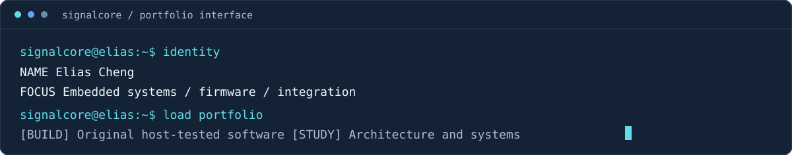

<picture>
  <source media="(prefers-color-scheme: dark)" srcset="assets/brand/hero-dark.svg">
  <source media="(prefers-color-scheme: light)" srcset="assets/brand/hero-light.svg">
  
</picture>

# Elias Cheng

I build testable embedded software, MCU application cores, board-planning tools, and host applications. This profile separates **implemented work** from **architecture studies** and **exploration**; host tests are not MCU or hardware validation.

<picture>
  <source media="(prefers-color-scheme: dark)" srcset="assets/brand/terminal-dark.svg">
  <source media="(prefers-color-scheme: light)" srcset="assets/brand/terminal-light.svg">
  
</picture>

## Featured engineering projects

Original, inspectable implementations with public host-side evidence. The linked repositories define their own build and hardware limits.

<picture>
  <source media="(prefers-color-scheme: dark)" srcset="assets/cards/featured-dark.svg">
  <source media="(prefers-color-scheme: light)" srcset="assets/cards/featured-light.svg">
  
</picture>

| Project | Engineering focus | Public evidence boundary |
| --- | --- | --- |
| [Python Host Application](https://github.com/REliasCheng/Python-Host-Application-Lab) | Python/PyQt5 serial application with testable core and mock backend | Host tests, static checks and package build; no device validation |
| [Embedded C/C++ Core](https://github.com/REliasCheng/Embedded-C-Cpp-Learning) | Portable command, buffer and task-state modules | Host tests; no MCU target validation |
| [C51 Board Resource Planner](https://github.com/REliasCheng/C51-Board-Lab) | 8051 resource mapping and conflict detection | Host tests; no board validation |

## Current MCU work

Application and communication cores are distinguishable from a complete target firmware release.

<picture>
  <source media="(prefers-color-scheme: dark)" srcset="assets/cards/mcu-dark.svg">
  <source media="(prefers-color-scheme: light)" srcset="assets/cards/mcu-light.svg">
  
</picture>

| Project | Engineering focus | Public evidence boundary |
| --- | --- | --- |
| [STC8 MCU Learning](https://github.com/REliasCheng/STC8-MCU-Learning) | C89 UART RX ring buffer and 8051 adapter boundary | Host-tested core; no Keil target or board evidence |
| [STC89C52 Learning](https://github.com/REliasCheng/stc89c52-learning) | RTC, temperature and configuration state behind platform callbacks | Host tests; C51 target and hardware not verified |
| [BlueBridgeCup MCU](https://github.com/REliasCheng/BlueBridgeCup-MCU) | CT107D resource, timing and control policies | Host-tested policies; no complete target or board evidence |

## Architecture labs

These repositories communicate system design and technical boundaries. They are **not** presented as publicly implemented or hardware-verified systems.

<picture>
  <source media="(prefers-color-scheme: dark)" srcset="assets/cards/architecture-dark.svg">
  <source media="(prefers-color-scheme: light)" srcset="assets/cards/architecture-light.svg">
  
</picture>

| Project | Architecture focus |
| --- | --- |
| [ARM Cortex-M](https://github.com/REliasCheng/ARM-Cortex-M-Development-Lab) | Startup, interrupts, clocks and driver layering |
| [FreeRTOS](https://github.com/REliasCheng/FreeRTOS-Embedded-Lab) | Scheduling, IPC and ISR-to-task design |
| [LVGL Embedded GUI](https://github.com/REliasCheng/LVGL-Embedded-GUI-Lab) | Display, input, rendering and event pipeline |
| [Wireless / IoT](https://github.com/REliasCheng/Wireless-IoT-Embedded-Lab) | Native Wi-Fi → lwIP → TCP → plain MQTT model; no TLS or live sensor evidence |
| [Firmware Update / OTA](https://github.com/REliasCheng/Embedded-OTA-Update-Lab) | Bootloader, UART/YMODEM, MQTT and CRC boundary model; no A/B or rollback claim |

## Exploration and foundations

<picture>
  <source media="(prefers-color-scheme: dark)" srcset="assets/cards/exploration-dark.svg">
  <source media="(prefers-color-scheme: light)" srcset="assets/cards/exploration-light.svg">
  
</picture>

- [Embodied Robotics Arm](https://github.com/REliasCheng/Embodied-Robotics-Arm-Lab) — LeRobot/robotic-arm integration study involving third-party code; no functional or hardware run claimed.
- [ARM Embedded Linux](https://github.com/REliasCheng/ARM-Linux-Embedded-Lab) — RK3566 boot, Device Tree and driver-interface research; no public kernel build or board runtime claimed.
- [Embedded Systems Foundations](https://github.com/REliasCheng/Embedded-Systems-Foundations) — electronics, digital logic, CPU, MCU and PCB knowledge map; a documentation project, not runnable firmware.

## Technology path

Electronics and digital logic → C/C++ software and host tests → 8051/STC cores → Cortex-M, RTOS and GUI architecture → Wireless, firmware update, robotics and Embedded Linux exploration.

This is a learning and design progression, **not a claim that every layer is implemented or validated**. Follow each repository's README for its exact evidence level.

## Public telemetry

The panel below is a **dated preview snapshot** from public GitHub API data, not a live service. Its host-CI status is bound to each repository's current `main` SHA. `PASS` does not mean target build or hardware validation; an unavailable API result remains `UNAVAILABLE`.

<picture>
  <source media="(prefers-color-scheme: dark)" srcset="assets/preview/telemetry-dark.svg">
  <source media="(prefers-color-scheme: light)" srcset="assets/preview/telemetry-light.svg">
  
</picture>

Contribution activity preview

Contribution activity reflects public GitHub events, not engineering quality. Until the contribution-snake Action has produced and verified its preview files, this section intentionally uses an original static fallback. It never represents a fabricated contribution history.

<picture>
  <source media="(prefers-color-scheme: dark)" srcset="assets/fallback/contribution-dark.svg">
  <source media="(prefers-color-scheme: light)" srcset="assets/fallback/contribution-light.svg">
  
</picture>

<picture>
  <source media="(prefers-color-scheme: dark)" srcset="assets/brand/footer-dark.svg">
  <source media="(prefers-color-scheme: light)" srcset="assets/brand/footer-light.svg">
  
</picture>

The [design system](docs/design-system.md), [preview notes](docs/preview.md), and [maintenance guide](docs/maintenance.md) explain the visual components and how their evidence is kept accurate. Original profile content follows this repository's [LICENSE](LICENSE); third-party repositories and tools retain their own terms. No blanket license claim is made over linked projects, vendor material or dependencies.
