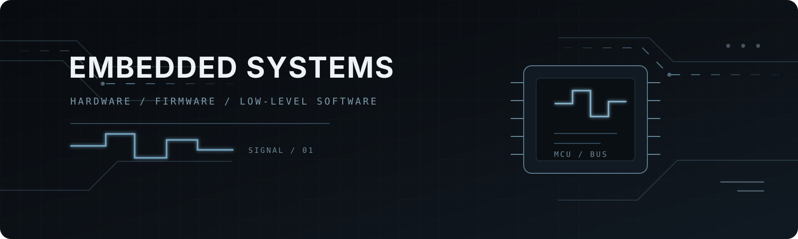

<p align="center">
  
</p>

# 👋 Hi, I'm Elias

**Embedded Systems Developer**

Building systems from hardware to firmware.

## What I Build

### Embedded Firmware

Firmware foundations built around clear interfaces, predictable state, and hardware-aware constraints.

### Peripheral and Board-Level Software

Resource-aware peripheral integration, board mapping, timing, communication, and device control.

### Modular Embedded Systems

Portable application cores, state machines, callback-based modules, and host-tested software boundaries.

## Current Work

### [Embedded C/C++](https://github.com/REliasCheng/Embedded-C-Cpp-Learning)

C/C++ software structure with host-tested command processing, task state management, and modular firmware components.

### [BlueBridgeCup MCU](https://github.com/REliasCheng/BlueBridgeCup-MCU)

CT107D / 8051 peripheral integration focused on shared resources, timing, communication, and host-tested control policies.

### [C51 Board Resource Planner](https://github.com/REliasCheng/C51-Board-Lab)

An 8051 board resource planning tool for mapping peripherals and detecting GPIO, timer, and communication conflicts through host-tested cases.

### [STC89C52 Application Architecture](https://github.com/REliasCheng/stc89c52-learning)

STC89C52RC application architecture with a portable core, state-machine control, persistent configuration, and host-tested logic.

### [Embedded Systems Foundations](https://github.com/REliasCheng/Embedded-Systems-Foundations)

Documentation connecting electronics, digital logic, CPU architecture, PCB workflow, and MCU interface concepts.

## Technology Path

```text
Foundation
├── Electronics / Digital Logic / PCB
└── C/C++ / Modular Software / Host Test

MCU Systems
├── 8051 / STC89
├── STC8
└── ARM Cortex-M

Embedded Software
└── FreeRTOS / Scheduling / IPC / ISR-to-Task

Application and System Integration
├── LVGL / Embedded GUI
├── Wireless / IoT
└── Bootloader / OTA
```

## Technical Roadmap

- [STC8 MCU](https://github.com/REliasCheng/STC8-MCU-Learning) — enhanced 8051 peripherals and system integration
- [ARM Cortex-M](https://github.com/REliasCheng/ARM-Cortex-M-Development-Lab) — firmware foundations and peripheral drivers
- [FreeRTOS](https://github.com/REliasCheng/FreeRTOS-Embedded-Lab) — scheduling, synchronization, IPC, and ISR-to-task design
- [LVGL / Embedded GUI](https://github.com/REliasCheng/LVGL-Embedded-GUI-Lab) — display, input, and embedded GUI integration
- [Wireless / IoT](https://github.com/REliasCheng/Wireless-IoT-Embedded-Lab) — TCP/IP, MQTT, and device connectivity
- [Bootloader / OTA](https://github.com/REliasCheng/Embedded-OTA-Update-Lab) — firmware update architecture and image lifecycle

## Currently Exploring

`Embedded Linux`
